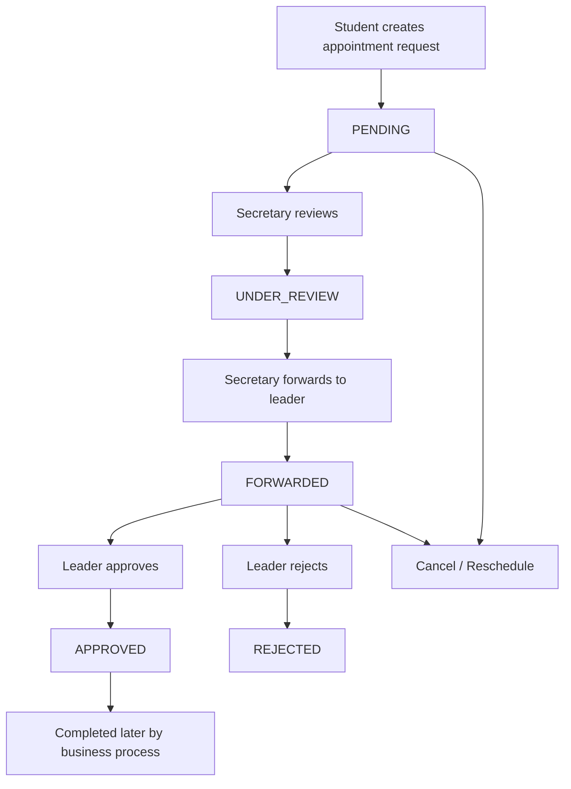

# Appointment Workflow Guide

This document explains the full appointment workflow in the University Leadership Appointment Management System. It is written as a step-by-step guide for working on the appointment feature without changing unrelated parts of the codebase.

## 1. Purpose of the workflow

The appointment module lets a student request a meeting with a university department or leadership office, then routes that request through a secretary and, when needed, a leader for final action.

The workflow is designed to:

- keep the appointment process role-based,
- prevent direct student-to-leader booking,
- avoid time conflicts,
- keep a full audit trail,
- notify the right users at each step.

## 2. Main roles

The workflow uses these roles:

- `STUDENT`: creates appointment requests.
- `SECRETARY`: reviews student requests and forwards them.
- `DEPARTMENT_HEAD`, `DEAN`, `VICE_PRESIDENT`, `PRESIDENT`: approve or reject forwarded appointments.
- `ADMIN`: has elevated control and can also reject in the current implementation.

## 3. High-level flow



## 4. Step-by-step appointment flow

### Step 1: Student creates a request

The student opens the appointment form and submits:

- target department,
- title,
- description,
- reason,
- date,
- start time,
- end time,
- location.

Important rules:

- students do not choose a leader directly,
- the system assigns the secretary by department,
- the appointment starts with status `PENDING`,
- `ADMIN` users cannot create appointment requests.

Route used:

```text
POST /api/appointments
```

Related lookup route:

```text
GET /api/appointments/departments
```

This helps the front end show valid departments before submission.

### Step 2: Secretary receives the request

When the appointment is created, the system tries to locate an active secretary for the selected department.

If a secretary exists:

- the request is linked to that secretary,
- a notification is created for the secretary,
- an audit log entry is written.

The request is still in `PENDING` until the secretary actively picks it up.

### Step 3: Secretary marks the request under review

The secretary can open the request and move it to review.

This changes the appointment status from `PENDING` to `UNDER_REVIEW`.

Route used:

```text
POST /api/appointments/:id/review
```

Effects:

- only users with the `SECRETARY` role can do this,
- the appointment is updated with the secretary ID,
- the requester gets a notification,
- an audit log is stored.

### Step 4: Secretary forwards the request to a leader

After review, the secretary forwards the appointment to a specific leader.

The secretary provides:

- `leaderId`,
- optional `note`,
- optional updated date/time.

Route used:

```text
POST /api/appointments/:id/forward
```

Rules in this step:

- only `SECRETARY` users can do this,
- the request must be `PENDING` or `UNDER_REVIEW`,
- the chosen user must be a valid leader role,
- the system checks for time conflicts before forwarding,
- if there is a conflict, the request is rejected with a conflict error.

Effects:

- status changes to `FORWARDED`,
- the leader is assigned,
- the secretary note is saved,
- both the leader and requester receive notifications,
- an audit log entry is written.

### Step 5: Leader reviews the forwarded appointment

Once the appointment is `FORWARDED`, the assigned leader can take action.

Route used:

```text
POST /api/appointments/:id/approve
```

If the leader approves:

- status becomes `APPROVED`,
- the leader note is saved,
- the requester is notified,
- the secretary is notified if one is assigned,
- an audit log entry is written.

Route used for rejection:

```text
POST /api/appointments/:id/reject
```

If the leader rejects:

- status becomes `REJECTED`,
- the rejection reason is saved,
- the requester is notified,
- an audit log entry is written.

## 5. Cancel and reschedule flow

### Cancel

An appointment can be cancelled by the requester, the assigned leader, or the secretary.

Route used:

```text
POST /api/appointments/:id/cancel
```

Rules:

- only a participant in the appointment can cancel,
- already completed, cancelled, or rejected appointments cannot be cancelled again,
- the cancellation reason is stored,
- the other participants are notified,
- an audit log entry is written.

### Reschedule

Any participant can request a new time through the reschedule flow.

Route used:

```text
POST /api/appointments/:id/reschedule
```

The system:

- stores the old and new date/time values,
- checks for leader time conflicts,
- updates the appointment status to `RESCHEDULED`,
- notifies the secretary or leader,
- records the action in the audit log.

## 6. Slot checking

The front end can request available slots for a leader before booking or forwarding.

Route used:

```text
GET /api/appointments/slots/:leaderId?date=YYYY-MM-DD
```

This helps avoid double-booking by showing only open 30-minute slots.

## 7. Read and list flows

### List appointments

Route used:

```text
GET /api/appointments
```

The result is filtered by role:

- students see their own appointments,
- secretaries see requests in their department and appointments assigned to them,
- leaders see appointments assigned to them,
- admins can see everything.

### View one appointment

Route used:

```text
GET /api/appointments/:id
```

The appointment details include:

- requester data,
- leader data,
- secretary data,
- reschedule requests,
- recent audit logs.

## 8. Appointment statuses

The appointment status values currently used in the workflow are:

- `PENDING`
- `UNDER_REVIEW`
- `FORWARDED`
- `APPROVED`
- `REJECTED`
- `RESCHEDULED`
- `CANCELLED`
- `COMPLETED`

### Typical transitions

- `PENDING` -> `UNDER_REVIEW`
- `UNDER_REVIEW` -> `FORWARDED`
- `FORWARDED` -> `APPROVED`
- `FORWARDED` -> `REJECTED`
- any active state -> `CANCELLED`
- active state -> `RESCHEDULED`

## 9. Data stored during the workflow

The system records several important fields while processing appointments:

- requester,
- secretary,
- leader,
- target department,
- title,
- description,
- reason,
- date,
- start time,
- end time,
- location,
- status,
- rejection reason,
- cancellation reason,
- secretary note,
- leader note.

It also stores:

- notifications,
- audit log entries,
- reschedule request records.

## 10. Validation and safety rules

The appointment workflow uses these safety checks:

- required fields must be present,
- date and time values must be valid,
- start time must be before end time,
- secretaries must be active and belong to the selected department,
- only valid leader roles can receive forwarded requests,
- the system checks for conflicting leader appointments before forwarding or rescheduling.

## 11. What to work on safely next

If you want to keep working only inside the appointment feature, good low-risk follow-up tasks are:

- improve conflict detection messages,
- add more appointment service unit tests,
- split helper functions out of `appointmentService.js`,
- add better error handling for missing secretary or leader data,
- update the mobile appointment form to explain the secretary-first flow more clearly.

## 12. Summary

The appointment workflow is a secretary-first approval flow:

1. student submits a request,
2. secretary picks it up,
3. secretary forwards it to a leader,
4. leader approves or rejects,
5. participants can cancel or reschedule when allowed.

This guide is isolated documentation only and does not change application behavior.
