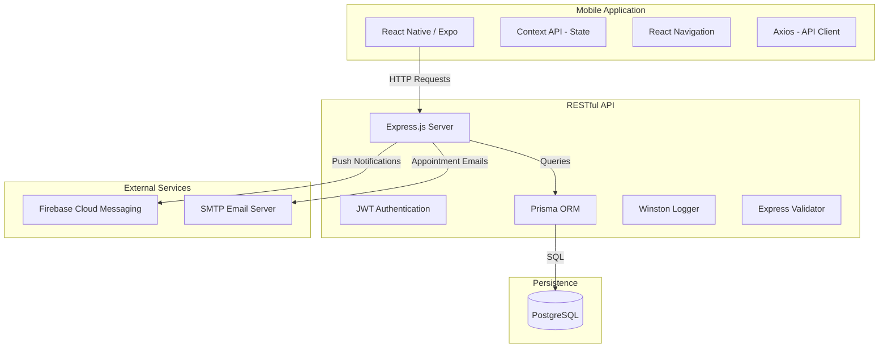

# System Architecture Overview

The **University Leadership Appointment Management System** is built with a modern, scalable architecture designed for high availability and ease of maintenance.

## High-Level Architecture

## Module Breakdown

### 1. Frontend (Mobile)
- **Navigation**: Uses `react-navigation` with a Stack-inside-Tabs structure. Role-based routing ensures users only see relevant dashboards.
- **State Management**: Uses `Context API` for Auth and Notifications to avoid prop drilling while keeping the app lightweight.
- **Styling**: Vanilla `StyleSheet` with a centralized `theme/colors.js` for a consistent, premium look and feel.
- **Offline Support**: `expo-secure-store` stores tokens and user data securely.

### 2. Backend (API)
- **Controller-Service Pattern**: Controllers handle HTTP logic, while Services contain the business logic, making the code highly testable.
- **Middleware**: 
    - `authMiddleware`: Validates JWT tokens.
    - `roleMiddleware`: Handles RBAC (Role-Based Access Control).
    - `errorMiddleware`: Standardized global error handling.
- **Validation**: Strict input validation using `express-validator` to ensure data integrity.

### 3. Database (Schema)
- **User**: Multi-role users (Student, Secretary, Leader, Admin).
- **Appointment**: Tracks status, times, and participants.
- **Availability**: Allows leaders to define their working hours/slots.
- **Notification**: Persists in-app notifications.

## Key Features
- **Appointment Lifecycle**: Approval flow involving secretaries and leaders.
- **Conflict Detection**: Prevents double-booking same-time slots.
- **Real-time Notifications**: Uses FCM (optional) and in-app polling/context updates.
- **History & Tracking**: Full audit trail of status changes (cancellation reasons, etc.).
